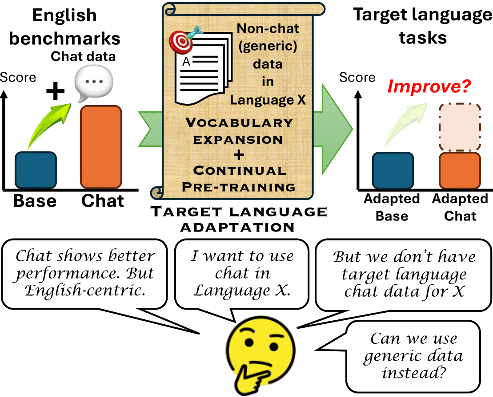

Vocabulary Expansion of Chat Models with Unlabeled Target Language Data
===

This is a repository for the paper "Vocabulary Expansion of Chat Models with Unlabeled Target Language Data".



## Requirements
See `requirements.txt` for the required packages. Also, we require PyTorch v2 or higher.

If you are using the `conda` package manager, you can create a new environment with the required packages by running:
```bash
# Create a new env for training and evaluation
conda create --name dec2024 python=3.12
conda activate dec2024
conda install conda-forge::pytorch
mkdir -m 700 src
cd src && git clone https://github.com/huggingface/transformers.git
cd transformers
pip3 install -e .
pip3 install peft datasets evaluate bitsandbytes scikit-learn sentencepiece huggingface-hub tqdm pyarrow protobuf tiktoken lighteval

# Create a new env for IFEval evaluation
conda create --name dec2024_eval python=3.12
conda activate dec2024_eval
conda install conda-forge::pytorch
cd transformers
pip3 install -e .
pip3 install peft datasets evaluate bitsandbytes scikit-learn sentencepiece huggingface-hub tqdm pyarrow protobuf tiktoken
cd ..
git clone git@github.com:huggingface/lm-evaluation-harness.git
cd lm-evaluation-harness
git checkout main
pip3 install -e .
pip3 install langdetect immutabledict nltk
```

## Reproducing the results
### 1. Preprocessing
Please visit the [`preprocessing`](./preprocessing/README.md) directory.

### 2. Initializing the model
Please visit the [`instantiation`](./instantiation/README.md) directory.

### 3. Training the model
Please visit the [`training`](./training/README.md) directory.

### 4. Model merging
Please visit the [`merging`](./merging/README.md) directory.

### 5. Evaluation
Please visit the [`evaluation`](./evaluation/README.md) directory.


## Models
The models will available soon on the Hugging Face model hub.


## Citation
If you use this code or the models in your research, please cite the following paper:
```
@misc{yamaguchi-2024-vocabulary-expansion-chat,
      title={Vocabulary Expansion of Chat Models with Unlabeled Target Language Data}, 
      author={Atsuki Yamaguchi and Terufumi Morishita and Aline Villavicencio and Nikolaos Aletras},
      year={2024},
}
```

## License
This code is licensed under the [MIT License](./LICENSE) unless otherwise stated in the file.
